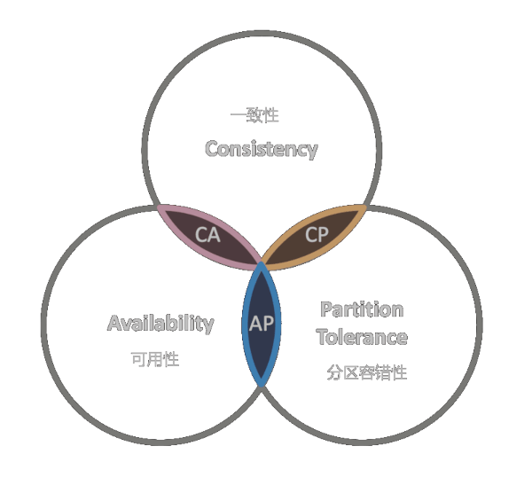
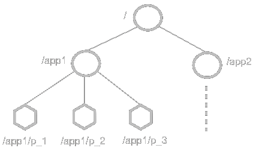

<link rel="stylesheet" href="https://zhmhbest.gitee.io/hellomathematics/style/index.css">
<script src="https://zhmhbest.gitee.io/hellomathematics/style/index.js"></script>

# [Zookeeper](../index.html)

[TOC]

## 基本概念

ZooKeeper是一种分布式协调服务。

### CAP理论



- **一致性（Consistency）**：在分布式环境中，一致性是指数据在多个副本之间是否能够保持一致的特性，等同于所有节点访问同一份最新的数据副本。在一致性的需求下，当一个系统在数据一致的状态下执行更新操作后，应该保证系统的数据仍然处于一致的状态。

- **可用性（Availability）**：每次请求都能获取到正确的响应，但是不保证获取的数据为最新数据。

- **分区容错性（Partition tolerance）**：分布式系统在遇到任何网络分区故障的时候，仍然需要能够保证对外提供满足一致性和可用性的服务，除非是整个网络环境都发生了故障。

一个分布式系统最多只能同时满足三项中的两项，P是必须的，Zookeeper保证的是**CP**。

### 整体架构

|||
|-|-|
|Client  |分布式应用集群中的一个节点
|Server  |ZooKeeper集群中的一个节点
|Ensemble|ZooKeeper服务器组，形成所需的最小节点数为3
|Leader  |ZooKeeper集群内部各个服务的调度者
|Follower|ZooKeeper集群内部跟随Leader指令的节点
|Observer|与Follower类似，但不参与投票

### 主从服务器

Leader选举分为Zookeeper集群启动时选举和Zookeeper集群运行期间重新选举两种情况。

若节点服务器启动时发现已经有Leader节点，则不再进行投票。

为防止脑裂导致服务瘫痪，最好使用奇数数量的Zookeeper节点。

#### 节点状态

- LOOKING：正在寻找Leader服务器
- LEADING：当前节点角色是`leader`
- FOLLOWING：当前节点角色是`follower`
- OBSERVER：当前节点角色是`observer`

### 层次命名空间



Zookkeeper提供的名称空间类似于标准文件系统。

```bash
zkCli.sh

# 查看节点下子节点
ls /

# 查看Znode节点信息
# get -s /
stat /
# cZxid = 0x0
# ctime = Thu Jan 01 08:00:00 CST 1970
# mZxid = 0x0
# mtime = Thu Jan 01 08:00:00 CST 1970
# pZxid = 0x100000003
# cversion = 0
# dataVersion = 0
# aclVersion = 0
# ephemeralOwner = 0x0
# dataLength = 0
# numChildren = 2
```

## 系统配置

### 添加域名

```bash
# 对所有主机统一修改
vim /etc/hosts
# G
# o
# ...
# wq
more /etc/hosts
```

```txt
192.168.1.101 zookeeper1
192.168.1.102 zookeeper2
192.168.1.103 zookeeper3
```

### 设置主机名称

```bash
# 对每台主机定制修改
hostnamectl set-hostname 'zookeeper1'
hostname -f
```

## 安装

### 安装Java

```bash
yum -y install java
JAVA_HOME=$(echo /usr/lib/jvm/java-*-openjdk-*)
grep '^export JAVA_HOME' /etc/profile ||\
    echo "export JAVA_HOME=${JAVA_HOME}">>/etc/profile
tail -n 2 /etc/profile
```

### 安装Zookeeper

```bash
# 下载Zookeeper
# ZOOKEEPER_REPO='http://archive.apache.org/dist/zookeeper'
ZOOKEEPER_REPO='http://192.168.19.90/files/zookeeper'
ZOOKEEPER_LOCATION='/zookeeper' # 安装位置
ZOOKEEPER_VERSION='3.5.9'       # 安装版本
ZOOKEEPER_ARCHIVE="${ZOOKEEPER_REPO}/zookeeper-${ZOOKEEPER_VERSION}/apache-zookeeper-${ZOOKEEPER_VERSION}-bin.tar.gz"
echo $ZOOKEEPER_ARCHIVE
wget $ZOOKEEPER_ARCHIVE
tar -xvf "./apache-zookeeper-${ZOOKEEPER_VERSION}-bin.tar.gz"
pushd "./apache-zookeeper-${ZOOKEEPER_VERSION}-bin"
mkdir data log
cp -f ./conf/zoo_sample.cfg ./conf/zoo.cfg
cp -rf ./* $ZOOKEEPER_LOCATION
popd

# 修改基本配置
pushd $ZOOKEEPER_LOCATION/conf
ZOOKEEPER_DAT=$ZOOKEEPER_LOCATION/data
ZOOKEEPER_LOG=$ZOOKEEPER_LOCATION/log
grep -q '^dataDir=' ./zoo.cfg &&\
    sed -ri "/^dataDir=/s/=.+$/=`echo ${ZOOKEEPER_DAT//\//\\\/}`/"    ./zoo.cfg ||\
    echo "dataDir=${ZOOKEEPER_DAT}">>./zoo.cfg
grep -q '^dataLogDir=' ./zoo.cfg &&\
    sed -ri "/^dataLogDir=/s/=.+$/=`echo ${ZOOKEEPER_LOG//\//\\\/}`/" ./zoo.cfg ||\
    echo "dataLogDir=${ZOOKEEPER_LOG}">>./zoo.cfg
grep '^data' ./zoo.cfg
popd

# 加入环境变量
grep -q '^export ZOOKEEPER_HOME' /etc/profile ||\
    echo "export ZOOKEEPER_HOME=${ZOOKEEPER_LOCATION}">>/etc/profile && \
    echo 'export PATH=$ZOOKEEPER_HOME/bin:$PATH'>>/etc/profile
grep '^export ' /etc/profile
source /etc/profile
```

#### 集群配置

```bash
# myid
hostname=`hostname -f`
hostid=${hostname:0-1}
echo $hostid>$ZOOKEEPER_HOME/data/myid
head -n 1 $ZOOKEEPER_HOME/data/myid

# Server.Index
echo "server.1=zookeeper1:2888:3888">>$ZOOKEEPER_HOME/conf/zoo.cfg
echo "server.2=zookeeper2:2888:3888">>$ZOOKEEPER_HOME/conf/zoo.cfg
echo "server.3=zookeeper3:2888:3888">>$ZOOKEEPER_HOME/conf/zoo.cfg
tail -n 5 $ZOOKEEPER_HOME/conf/zoo.cfg
```

### 服务管理

```bash
# start | stop | restart | status
zkServer.sh start
zkServer.sh status | grep 'Mode:'
```
